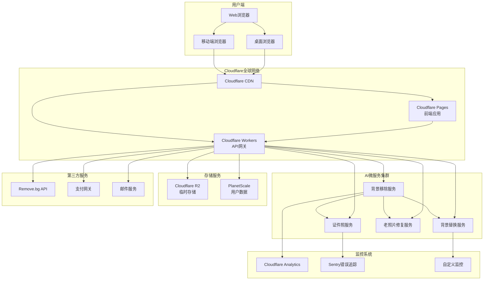
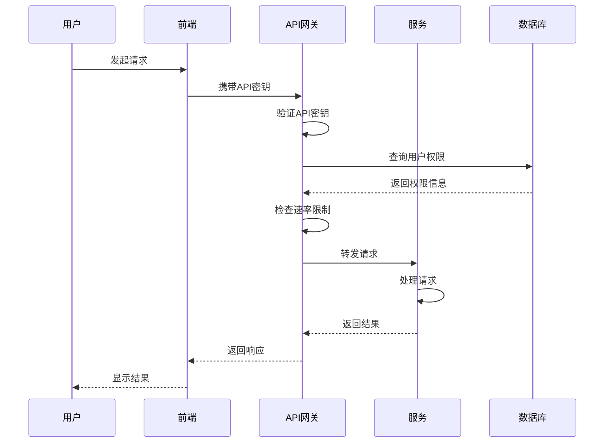

# 系统架构图 - PhotoMagic Studio

## 🏗️ 整体架构概览



## 📡 网络架构

### 1. 用户访问路径
```
用户请求 → Cloudflare DNS → Cloudflare CDN → 边缘节点
         ↓
   缓存命中 → 直接返回
         ↓
   缓存未命中 → Cloudflare Pages → 返回静态资源
         ↓
   API请求 → Cloudflare Workers → 路由分发
```

### 2. 全球加速架构
```
┌─────────────────────────────────────────────────┐
│               全球用户分布                       │
├─────────────────────────────────────────────────┤
│ 北美 🇺🇸     欧洲 🇪🇺     亚洲 🇨🇳     其他 🌍  │
│    ↓           ↓           ↓           ↓       │
├─────────────────────────────────────────────────┤
│           Cloudflare全球边缘节点                │
│        (300+节点, 100+国家/地区)                │
├─────────────────────────────────────────────────┤
│   就近处理 → 缓存命中 → 快速响应                 │
│        ↓           ↓           ↓               │
├─────────────────────────────────────────────────┤
│          统一API网关和AI服务集群                │
└─────────────────────────────────────────────────┘
```

## 🏢 应用架构

### 1. 前端应用架构
```
┌─────────────────────────────────────────────────┐
│               React前端应用                      │
├─────────────────────────────────────────────────┤
│ 组件层                                          │
│ ├── 布局组件 (Layout)                           │
│ ├── 页面组件 (Pages)                            │
│ ├── 功能组件 (Features)                         │
│ └── 通用组件 (Common)                           │
├─────────────────────────────────────────────────┤
│ 状态管理层                                        │
│ ├── Zustand状态存储                             │
│ ├── React Query数据缓存                         │
│ └── 本地存储 (localStorage)                     │
├─────────────────────────────────────────────────┤
│ 服务层                                          │
│ ├── API客户端                                   │
│ ├── 文件处理服务                                │
│ ├── 图片压缩服务                                │
│ └── 错误处理服务                                │
├─────────────────────────────────────────────────┤
│ 工具层                                          │
│ ├── 工具函数库                                  │
│ ├── 类型定义                                    │
│ ├── 常量配置                                    │
│ └── 环境配置                                    │
└─────────────────────────────────────────────────┘
```

### 2. API网关架构
```typescript
// Cloudflare Worker架构
interface APIGateway {
  // 请求处理流程
  async handleRequest(request: Request): Promise<Response> {
    // 1. 请求验证
    validateRequest(request);
    
    // 2. 路由分发
    const route = router.match(request);
    
    // 3. 限流检查
    checkRateLimit(request);
    
    // 4. 认证授权
    authenticate(request);
    
    // 5. 请求转发
    const response = await forwardToService(route);
    
    // 6. 响应处理
    return processResponse(response);
  }
  
  // 服务路由表
  const services = {
    '/api/v1/background-removal': 'bg-remove-service',
    '/api/v1/id-photo': 'idphoto-service',
    '/api/v1/background-replacement': 'bg-replace-service',
    '/api/v1/photo-restoration': 'restoration-service',
    '/api/v1/upload': 'upload-service',
    '/api/v1/batch': 'batch-service',
  };
}
```

### 3. AI服务架构
```python
# AI微服务架构
class AIService:
    def __init__(self):
        # 模型加载
        self.bg_removal_model = load_model('u2net')
        self.portrait_model = load_model('modnet')
        self.restoration_model = load_model('lama')
        self.colorization_model = load_model('deoldify')
        
    async def process_request(self, request_data):
        # 请求队列
        task_id = generate_task_id()
        
        # 异步处理
        result = await process_async(
            task_id=task_id,
            model=self.select_model(request_data),
            input_data=request_data
        )
        
        # 结果存储
        store_result(task_id, result)
        
        return {
            'task_id': task_id,
            'status': 'completed',
            'result_url': generate_result_url(task_id)
        }
```

## 💾 数据架构

### 1. 数据流设计
```
用户上传 → 前端压缩 → 临时存储 → AI处理 → 结果存储 → 用户下载
    ↓           ↓           ↓           ↓           ↓           ↓
文件验证   格式转换   24小时清理   模型推理   生成URL   自动清理
```

### 2. 存储策略
```yaml
storage_strategy:
  # 临时文件存储
  temp_files:
    location: Cloudflare R2
    retention: 24小时
    cleanup: 自动清理
    
  # 用户数据存储
  user_data:
    location: PlanetScale (MySQL)
    tables:
      - users: 用户信息
      - processing_history: 处理历史
      - favorites: 收藏记录
      
  # 缓存策略
  cache:
    cdn_cache: 1小时
    browser_cache: 15分钟
    api_cache: 5分钟
```

### 3. 数据库设计
```sql
-- 用户表
CREATE TABLE users (
  id VARCHAR(36) PRIMARY KEY,
  email VARCHAR(255) UNIQUE,
  created_at TIMESTAMP DEFAULT CURRENT_TIMESTAMP,
  plan ENUM('free', 'basic', 'pro', 'enterprise') DEFAULT 'free',
  api_key VARCHAR(64) UNIQUE
);

-- 处理历史表
CREATE TABLE processing_history (
  id VARCHAR(36) PRIMARY KEY,
  user_id VARCHAR(36) REFERENCES users(id),
  task_type ENUM('bg_removal', 'id_photo', 'bg_replace', 'restoration'),
  input_file_hash VARCHAR(64),
  result_file_url VARCHAR(512),
  processing_time_ms INTEGER,
  created_at TIMESTAMP DEFAULT CURRENT_TIMESTAMP,
  INDEX idx_user_created (user_id, created_at)
);
```

## 🔒 安全架构

### 1. 安全层设计
```
┌─────────────────────────────────────────────────┐
│               应用安全层                         │
├─────────────────────────────────────────────────┤
│ 输入验证 → XSS防护 → SQL注入防护 → 文件验证     │
├─────────────────────────────────────────────────┤
│               网络安全层                         │
├─────────────────────────────────────────────────┤
│ HTTPS强制 → CORS配置 → 速率限制 → WAF规则      │
├─────────────────────────────────────────────────┤
│               数据安全层                         │
├─────────────────────────────────────────────────┤
│ 数据加密 → 访问控制 → 审计日志 → 备份恢复       │
└─────────────────────────────────────────────────┘
```

### 2. 认证授权流程


## 📊 监控架构

### 1. 监控系统组成
```yaml
monitoring_stack:
  # 性能监控
  performance:
    - cloudflare_analytics: 访问统计
    - web_vitals: 核心Web指标
    - lighthouse: 性能评分
    
  # 错误监控
  errors:
    - sentry: 前端错误追踪
    - cloudflare_logs: 后端日志
    - custom_monitoring: 自定义监控
    
  # 业务监控
  business:
    - user_metrics: 用户指标
    - processing_metrics: 处理指标
    - revenue_metrics: 收入指标
    
  # 基础设施监控
  infrastructure:
    - uptime_robot: 可用性监控
    - cloudflare_status: 服务状态
    - resource_monitoring: 资源使用
```

### 2. 告警规则
```javascript
const alertRules = {
  // 性能告警
  performance: {
    api_response_time: {
      threshold: 5000, // 5秒
      window: '5m',
      severity: 'warning'
    },
    error_rate: {
      threshold: 0.05, // 5%
      window: '10m',
      severity: 'critical'
    }
  },
  
  // 业务告警
  business: {
    api_credits_low: {
      threshold: 0.1, // 10%
      severity: 'critical'
    },
    user_growth_stagnant: {
      threshold: -0.2, // -20%
      window: '7d',
      severity: 'warning'
    }
  },
  
  // 基础设施告警
  infrastructure: {
    service_down: {
      threshold: 0, // 0个健康实例
      severity: 'critical'
    },
    high_cpu_usage: {
      threshold: 0.8, // 80%
      window: '5m',
      severity: 'warning'
    }
  }
};
```

## 🚀 部署架构

### 1. 部署流程
```yaml
deployment_pipeline:
  stages:
    - name: "开发环境"
      trigger: "push to dev branch"
      actions:
        - "运行单元测试"
        - "构建前端应用"
        - "部署到dev环境"
        - "运行集成测试"
        
    - name: "测试环境"
      trigger: "pull request to main"
      actions:
        - "运行完整测试套件"
        - "性能测试"
        - "安全扫描"
        - "部署到staging环境"
        
    - name: "生产环境"
      trigger: "tag release"
      actions:
        - "最终验证"
        - "蓝绿部署"
        - "监控验证"
        - "发布完成"
```

### 2. 环境配置
```typescript
// 环境配置管理
interface EnvironmentConfig {
  // 开发环境
  development: {
    api_url: 'https://dev-api.photomagic.workers.dev',
    ai_service_url: 'http://localhost:8000',
    debug: true,
    log_level: 'debug'
  },
  
  // 测试环境
  staging: {
    api_url: 'https://staging-api.photomagic.workers.dev',
    ai_service_url: 'https://staging-ai.photomagic.workers.dev',
    debug: false,
    log_level: 'info'
  },
  
  // 生产环境
  production: {
    api_url: 'https://api.photomagic.workers.dev',
    ai_service_url: 'https://ai.photomagic.workers.dev',
    debug: false,
    log_level: 'warn'
  }
}
```

## 🔄 扩展性设计

### 1. 水平扩展
```yaml
scaling_strategy:
  # 前端扩展
  frontend:
    type: "CDN缓存"
    scaling: "自动"
    regions: "全球"
    
  # API网关扩展
  api_gateway:
    type: "Cloudflare Workers"
    scaling: "自动"
    limit: "无限制"
    
  # AI服务扩展
  ai_services:
    type: "Kubernetes集群"
    scaling:
      - metric: "CPU使用率"
        threshold: 70%
        action: "增加实例"
      - metric: "请求队列长度"
        threshold: 100
        action: "增加实例"
```

### 2. 容量规划
```yaml
capacity_planning:
  # 初始容量
  initial:
    users: 10,000
    daily_requests: 100,000
    storage: 100GB
    bandwidth: 1TB/month
    
  # 增长预测
  growth:
    month_3:
      users: 50,000
      daily_requests: 500,000
      storage: 500GB
      bandwidth: 5TB/month
      
    month_6:
      users: 200,000
      daily_requests: 2,000,000
      storage: 2TB
      bandwidth: 20TB/month
      
    month_12:
      users: 1,000,000
      daily_requests: 10,000,000
      storage: 10TB
      bandwidth: 100TB/month
```

## 🎯 架构原则

### 1. 设计原则
- **无状态**：所有服务无状态，便于扩展
- **微服务**：功能解耦，独立部署
- **边缘计算**：就近处理，减少延迟
- **自动扩展**：按需扩展，节约成本
- **故障隔离**：服务隔离，避免级联故障

### 2. 技术选型原则
- **成熟稳定**：选择经过验证的技术
- **社区活跃**：良好的社区支持和文档
- **成本效益**：合理的性价比
- **易于维护**：降低运维复杂度
- **未来兼容**：支持技术演进

---

*架构文档版本：v1.0*
*最后更新：2026-03-19*